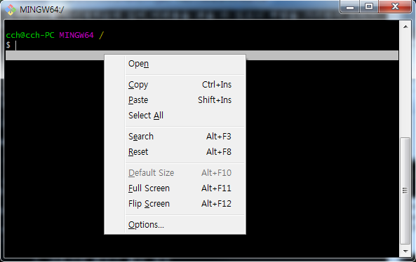
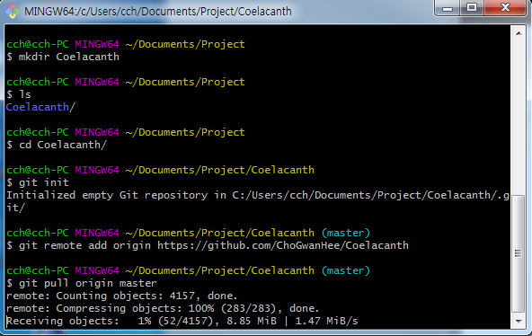

클라이언트 파일 Git 사용법
=====================

프로젝트 파일의 용량과 .zip / .7z 압축파일의 사용으로 디버그 / 빌드에 어려움을 겪고 있는 팀원들을 위해 작성한 Git 매뉴얼 입니다.
위 매뉴얼은 typora 환경에 최적화되어 있으며, 이미지 출력하는 명령어로 인해 타 편집기 또는 원격 저장소에서는 불편할 수 있습니다.
typora 프로그램으로 볼 경우, 좋은 환경에서 내용을 읽어보실 수 있습니다.
- https://typora.io/#windows

편리함을 추구하기 위해 작성된 매뉴얼이므로, 주어진 환경 내에서 따라해주시기 바랍니다.

------------

서론
------

기존에 프로젝트 파일 사용법은 개발자가 프로젝트 파일을 압축한 뒤, 카페에 업로드하고 타 파트 인원들이 압축 파일을 다운로드 받아서 유니티로 실행시키는 방식이었습니다.

하지만, 위 방법은 수 많은 리소스로 인해 장 시간을 기다려야하는 불편함을 감수해야 하기 때문에 타 파트 일원들이 짧은 시간에 효율적인 방법으로 접근할 수 있는 방법이 없을까 모색하던 중, **Github Storage**를 적극적으로 활용해보자는 생각으로 매뉴얼을 작성하게 되었습니다.

> **참고**
>
> - 시간비용을 효율적으로 줄일 수 있습니다.
> - 장소에 구애받지 않고 사용할 수 있습니다.
> - 한가지 하드웨어에 의존하지 않을 수 있습니다.

본론
------

#### Chapter 1. Git 원격 저장소 툴 설치 : Git Bash

> **설명충**
> 
> Sourcetree를 이용하여 Github를 편리하게 사용할 수 있지만, 작성자가 Sourcetree를 잘 다루지 못하기 때문에 작성자의 경험을 바탕으로 작성되었습니다.
> Git bash는 Linux Shell 기반으로 관리되어지기 때문에 Linux Command를 사용합니다.
> 영어 타자를 타이핑하는데 있어 어려움을 겪을 수 있으니 부담을 가지면서 오타가 나오지 않게 신중히 작성하시기 바랍니다.
> 
> ------------
> 	여러분이 겪는 고통은 저의 행복입니다.

1. https://git-scm.com/downloads Git Bash 사이트에 접속해서 플랫폼에 맞는 버전으로 다운로드 합니다.

2. 처음 설치화면이 나타나면, 당황하지말고 **Next >** 버튼을 정확히 8번 클릭합니다.

3. 설치가 완료되면, Release를 생략하고 바로 실행합니다.

#### Chapter 2. 프로젝트 관리 폴더 생성 : 부모 디렉토리

> **설명충**
>
> Github에서 zip파일을 다운로드해서 사용할 수 있지만, 이 방법은 기존에 추구하던 방식과 매우 흡사하기 때문에 본문에서 다루지 않습니다.
> 원격 저장소로 다룰 수 있는 **¹**디렉토리를 생성하여 pul 기능을 사용하기 위한 매뉴얼이므로 궁금한 점이 있어도 머릿속으로만 생각하시면 됩니다.
> 리눅스 명령어에 어려움을 격을 수 있기 때문에 Chapter 3의 설명을 쉽게 이해할 수 있도록 폴더 생성하는 경로를 동일하게 맞춰주시기 바랍니다.
> (작성자는 프로젝트 파일을 D드라이브 → Project Files 경로 안에 정리하는 강박증을 가지고 있으므로, 명령어에 익숙한 분들은 개인이 원하는 경로에 폴더를 만들어서 따라해주시면 됩니다.)
> (
> 	1. 내문서 폴더 이동
> 	2. 내문서에 Project 폴더 생성
> 	
> ------------
> 	Project 폴더는 Coelacanth 저장소의 데이터를 가져올 수 있는 부모 디렉토리가 됩니다. 
> )

#### Chapter 3. 원격 저장소 프로젝트 폴더 생성 : 자식 디렉토리

> **설명충**
>
> Chapter 2에서 생성한 폴더는 유니티 파일을 알아보기 편한 경로에 넣는 과정이었습니다.
> Chapter 3에서는 클라이언트 파일을 가져올 수 있는 폴더를 만들고 추가로 Git 기능을 사용할 수 있게 초기화 과정을 진행합니다.
> 간단한 부연설명도 작성하지만, 꼭 읽을 필요는 없습니다.
> 명령어만 복사해서 진행해도 문제 없으니 부담갖고 과정을 똑같이 진행해주시기 바랍니다.
> (설명 : 명령어)
> 명령어 부분에 있는 영역만 드래그해서 복사해주시면 됩니다.
> 참고로 명령어를 복사 / 붙여넣기 과정으로 편리하게 진행할 수 있는데, 윈도우의 단축키와 다르므로 이 점 유의하시고 Chapter 3를 진행해주시기 바랍니다.
>
> 마우스 드래그로 복사를 한 뒤, 오른쪽 클릭을 하면 팝업이 생성됩니다. (사진참고)
> 
> **아래에 적힌 2가지 방법 중 한가지를 선택**
> ------------
> - 마우스 오른쪽 클릭을 통한 클릭방식
> : 매뉴얼에 적힌 명령어를 복사가 되어있는 상태에서 bash 화면에 오른쪽 클릭 후, Paste 클릭
> - 키보드 단축키를 통한  매크로방식
> : 매뉴얼에 적힌 명령어를 복사가 되어있는 상태에서 bash 화면에 Shift + Ins 입력

1. 홈 디렉토리로 이동 : cd ~

2. 내문서로 이동 : cd Documents

3. Project 폴더 생성 : mkdir Project

4. 생성한 Project 폴더 이동 : cd Project

5. Git 원격 저장소와 연동할 폴더 생성 : mkdir Coelacanth

6. 폴더 생성여부 확인 : ls

7. 생성한 Coelacanth 폴더 이동

8. 디렉토리 Git 초기화 : git init

9. Git 원격 저장소 데이터 가져오기 : git remote add origin
**[Warning] 9번에서는 절대 Enter치지 말고**
아래 사진과 같이 붙여넣기만 해주시기 바랍니다.

10. Coelacanth Github 주소 복사 : https://github.com/ChoGwanHee/Coelacanth
https 사이트 경로를 복사해주시면 됩니다.

11. 8번에서 작성한 부분 뒤에 주소 붙여넣기 : 마우스 클릭 또는 키보드 입력

12. 원격 저장소 데이터 가져오기 : git pull origin master

13. error 여부 확인 : -

14. 데이터 확인 : ls -alrt

위 과정까지 진행하면, 원격 저장소에 있는 데이터가 /c/Users/이름/Documents/Project/Coelacanth 경로에 Fork 됩니다.
유니티를 실행해서 위 경로에 해당하는 프로젝트를 Open 해주시면 됩니다.
최초 1회는 캐시 데이터를 생성하면서 기존과 같이 장 시간동안 로딩됩니다.

정상적으로 로딩이 됐을 경우, Git 원격 저장소에 업데이트가 된 데이터를 최신화 시키기 위해서는 명령어 입력을 한번 더 행동해줘야 합니다.

15. 데이터 최신화 : git pull origin master

error가 발생하는지 확인하고 유니티 프로젝트를 확인하면, 업데이트되면서 데이터가 적용된 것을 확인할 수 있습니다.

결론
------

최신화된 데이터를 가져와 명령어 한 줄 입력으로 편리하게 프로젝트 파일을 업로드 하는 방식을 알게 되었습니다.
위 과정에서 안되는 부분이나 궁금한 점이 있으신 분은 **샷추가 된 아이스아메리카노** 한잔 들고 찾아와서 질문해주시기 바랍니다.
기획 / 아트 파트에서도 자유로이 프로젝트를 다룰 수 있는 Git 매뉴얼이었습니다.

# 긴 글 읽어주셔서 감사합니다.
## writer : Cho Gwan Hee
### data : 2018-06-04
#### copyright : coelacanth
##### thanks : undefiend
